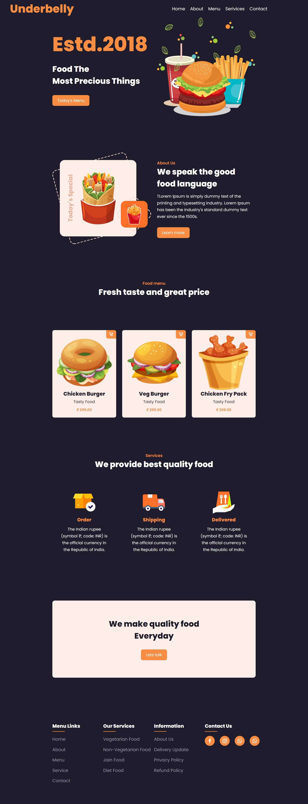

<h1><b>Underbelly Restaurant Website</b></h1>

<h2><b>Introduction</b></h2>
UnderBelly VIT Bhopal is in Bhopal, India. ... A to Z of a healthy diet to help you tackle the complexities of science all day long.Underbelly Restaurant is a popular dining destination known for its unique and innovative dishes. The frontend website serves as a digital platform for customers to explore the restaurant's menu.
 
<h2><b>Project Overview</b></h2>
 
This is just front-end  and built using HTML, CSS, and JavaScript.

<h2><b>Getting Started </b></h2>
 
To use  the  website code, follow these steps:
 
Clone the repository and use it
  

 
<b><h2>Application Features</h2></b>
 
The  website  includes the following features:
 
1.Animation on scroll
2.Responsive design
3.Gradient colour scheme
4.Supported in almost all browsers

 
<b><h2>Screenshot : </h2></b>
 

Feel free to explore and provide feedback on the user experience or report any issues you encounter.

<b><h2>License </h2></b>

You are free to use, modify, and distribute the codebase for personal or commercial purposes. However, attribution to Underbelly Restaurant is appreciated.
